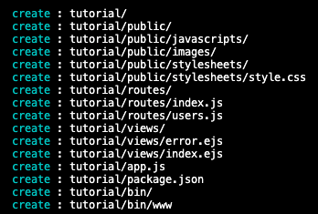

# How to generate a express.js app skeleton using express-generator

1. The first step would be to give root permission to the directory you'll be working in if you don't already have it, because express-generator creates directories and files for you:

    `sudo chown **user** /the/path/to/your/app/`

2. You then need to install express-generator using the command:

    `npm install -g express-generator`

3. The following cammand will then create the express.js app skeleton using the ejs engine:

    `express --view=ejs **appName**`
    
    In this case tutorial is the name of the app

    

4. Next change directories into the newly generated one:

    `cd tutorial/` **your app name**

5. Install the apps required dependencies:

    `npm install`

- Congratulations you now have an express.js app skeleton, now you can start making it your own.

- PS. to start the app type this command:

    `DEBUG=**appName**:*npm start`

- After doing this you will be able to see your app on port 3000